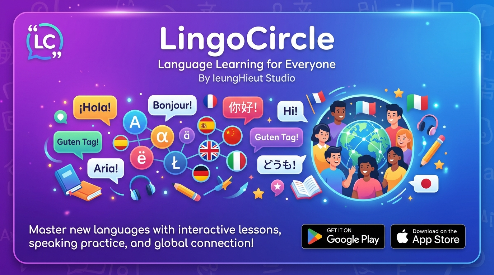

# IeungHieut Studio

---

## 🇰🇷 한국어

**IeungHieut Studio**는 Android & iOS 앱을 개발하는 인디 스튜디오입니다.

### 📱 대표 앱 — LingoCircle

> 언어 학습을 더 재미있고 효율적으로!

**LingoCircle**은 인터랙티브한 학습 방식으로 새로운 언어를 배울 수 있는 언어 학습 앱입니다. Android와 iOS 모두 지원합니다.

---

## 🌐 English

**IeungHieut Studio** is an indie studio focused on developing apps for Android & iOS.

### 📱 Featured App — LingoCircle

> Make language learning fun and effective!

**LingoCircle** is a language learning app that helps you master new languages through interactive lessons and engaging content. Available on both Android and iOS.

---

© IeungHieut Studio. All rights reserved.